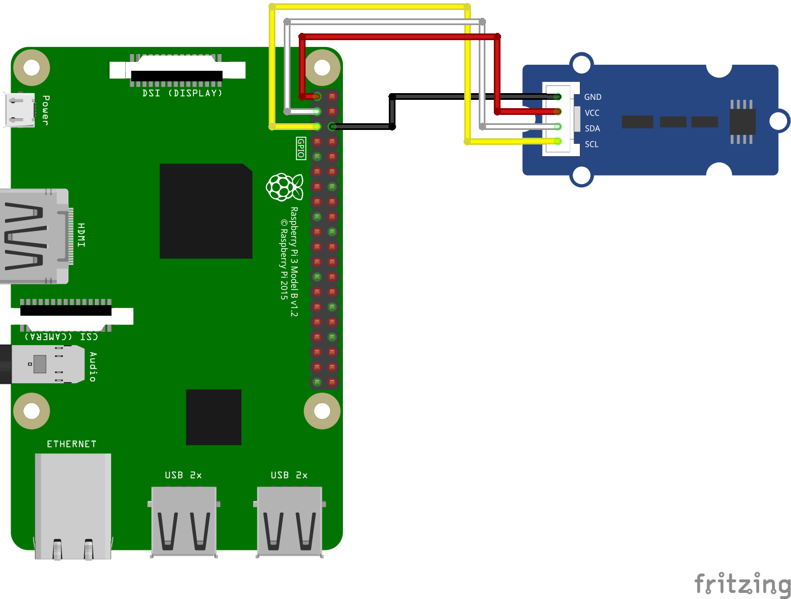

# MCP9808 高精度温度センサ

* 動作電圧 :3.3V、5V
* 動作範囲 :-40°C ～ +125°C
* I2Cアドレス  :0x18 〜 0x1F（デフォルト0x18）

[製品ページ](https://www.switch-science.com/products/3986)
[販売元ページ](https://www.seeedstudio.com/Grove-I2C-High-Accuracy-Temperature-Sensor-MCP9808.html)

## 配線図



## サンプルコード

```javascript
import {requestI2CAccess,MCP9808} from "chirimen";

const i2cAccess = await requestI2CAccess();
const i2cPort = i2cAccess.ports.get(1);

const mcp9808 = new MCP9808(i2cPort, 0x18);
await mcp9808.init();

await mcp9808.wake();
await mcp9808.setResolution(3);

const interval = setInterval(async function() { 

  let mode = await mcp9808.getResolution();
  let data_t = await mcp9808.readTempC();
  let data_f = await mcp9808.readTempF();
  console.dir(mode);
  console.dir({"T":data_t,"F":data_f});

}, 1000);
```

## コード解説
```
const mcp9808 = new MCP9808(i2cPort, 0x18);
```
デフォルトのI2Cアドレスは0x18です。  
AD0からAD2をそれぞれLOW(0)側またはHIGH(1)側にはんだ付けすることで、以下のようにI2Cアドレスを変更することができます。  
||AD0|AD1|AD2|
|---|---|---|---|
|0x18|0|0|0|（デフォルト）
|0x19|0|0|1|
|0x1A|0|1|0|
|0x1B|0|1|1|
|0x1C|1|0|0|
|0x1D|1|0|1|
|0x1E|1|1|0|
|0x1F|1|1|1|. 


```
await mcp9808.setResolution(3);
```
引数に応じて、温度の分解能を設定します。  
|0||0.5 °C|30 ms|
|1||0.25 °C|65 ms|
|2||0.125 °C|130 ms|
|3||0.0625 °C|250 ms|. 